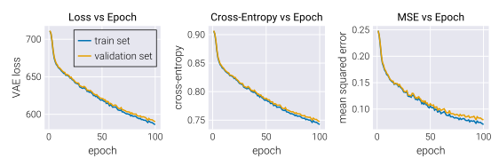
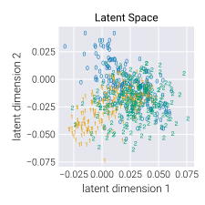

# Quick Start

!!! warning
    In this guide we will use external packages with functions not directly
    related to `AutoEncoderToolkit.jl`. such as
    [`Flux.jl`](https://github.com/FluxML/Flux.jl) and
    [`MLDatasets.jl`](https://github.com/JuliaML/MLDatasets.jl). Make sure to
    install them before running the code if you want to follow along.

For this quick start guide, we will prepare different autoencoders to be trained
on a fraction of the `MNIST` dataset. Let us begin by importing the necessary
packages.

!!! note
    We prefer to load functions using the `import` keyword instead of `using`.
    This is a personal preference and you can use `using` if you prefer.

```julia
# Import project package
import AutoEncoderToolkit as AET

# Import ML libraries
import Flux

# Import library to load MNIST dataset
using MLDatasets: MNIST

# Import library to save models
import JLD2
```

Now that we have imported the necessary packages, we can load the `MNIST`
dataset. For this specific example, we will only use digits `0`, `1`, and `2`,
taking 10 batches of 64 samples each. We will also use 2 batches with the same
number of samples for validation.

```julia
# Define number of samples in batch
n_batch = 64
# Define total number of data points
n_data = n_batch * 10
# Define number of validation data points
n_val = n_batch * 2

# Define lables to keep
digit_label = [0, 1, 2]

# Load data and labels
data, labels = MNIST.traindata(
    ; dir="your_own_custom_path/data/mnist"
)

# Keep only data with labels in digit_label
data_filt = dataset.features[:, :, dataset.targets.∈Ref(digit_label)]
labels_filt = dataset.targets[dataset.targets.∈Ref(digit_label)]

# Reduce size of training data and reshape to WHCN format
train_data = Float32.(reshape(data_filt[:, :, 1:n_data], (28, 28, 1, n_data)))
train_labels = labels_filt[1:n_data]

# Reduce size of validation data and reshape to WHCN format
val_data = Float32.(
    reshape(data_filt[:, :, n_data+1:n_data+n_val], (28, 28, 1, n_val))
)
val_labels = labels_filt[n_data+1:n_data+n_val]
```

Furthermore, for this particular example, we will use a binarized version of the
`MNIST` dataset. This means that we will convert the pixel values to either `0`
or `1`.

```julia
# Define threshold for binarization
thresh = 0.5

# Binarize training data
train_data = Float32.(train_data .> thresh)

# Binarize validation data
val_data = Float32.(val_data .> thresh)
```

Let's look at some of the binarized data.


## Define Encoder and Decoder

!!! tip
    For this walkthrough, we will define the layers of the encoder and decoder
    by hand. But, for other cases, make sure to check the default initializers
    in the [Encoders and Decoders](@ref encodersdecoders) section.

With the data in hand, let us define the encoder and decoder for the variational
autoencoder. The encoder will be a simple convolutional network with two
convolutional layers and a latent dimensionality of 2. Since we will use the
[`JointGaussianLogEncoder`](@ref JointGaussianLogEncoder) type that defines the
encoder as a Gaussian distribution with diagonal covariance, returning the mean
and log standard deviation, we also need to define two dense layers that map the
output of the convolutional to the latent space.

In this definition we will use functions from the `Flux` package to define the
the convolutional layers and the dense layers. We will also use the custom
[`Flatten`](@ref flatten) layer from `AutoEncoderToolkit.jl` to flatten the
output of the last convolutional layer before passing it to the dense layers.

```julia
# Define dimensionality of latent space
n_latent = 2

# Define number of initial channels
n_channels_init = 128

println("Defining encoder...")
# Define convolutional layers
conv_layers = Flux.Chain(
    # First convolutional layer
    Flux.Conv((3, 3), 1 => n_channels_init, Flux.relu; stride=2, pad=1),
    # Second convolutional layer
    Flux.Conv(
        (3, 3), n_channels_init => n_channels_init * 2, Flux.relu;
        stride=2, pad=1
    ),
    # Flatten the output
    AET.Flatten()
)

# Define layers for µ and log(σ)
µ_layer = Flux.Dense(n_channels_init * 2 * 7 * 7, n_latent, Flux.identity)
logσ_layer = Flux.Dense(n_channels_init * 2 * 7 * 7, n_latent, Flux.identity)

# build encoder
encoder = AET.JointGaussianLogEncoder(conv_layers, µ_layer, logσ_layer)
```

!!! note
    The [`Flatten`](@ref flatten) layer is a custom layer defined in
    `AutoEncoderToolkit.jl` that flattens the output into a 1D vector. This
    flattening operation is necessary because the output of the convolutional
    layers is a 4D tensor, while the input to the `µ` and `log(σ)` layers is a
    1D vector. The custom layer is needed to be able to save the model and load
    it later as `BSON` and `JLD2` do not play well with anonymous functions.

In the same way, the decoder will be a simple deconvolutional network with two
deconvolutional layers. Given the binary nature of the `MNIST` dataset we are
using, the probability distribution that makes sense to use in the decoder is a
Bernoulli distribution. We will therfore define the decoder as a
[`BernoulliDecoder`](@ref BernoulliDecoder) type. This means that the output of
the decoder must be a value between 0 and 1. 

```julia
# Define deconvolutional layers
deconv_layers = Flux.Chain(
    # Define linear layer out of latent space
    Flux.Dense(n_latent => n_channels_init * 2 * 7 * 7, Flux.identity),
    # Unflatten input using custom Reshape layer
    AET.Reshape(7, 7, n_channels_init * 2, :),
    # First transposed convolutional layer
    Flux.ConvTranspose(
        (4, 4), n_channels_init * 2 => n_channels_init, Flux.relu;
        stride=2, pad=1
    ),
    # Second transposed convolutional layer
    Flux.ConvTranspose(
        (4, 4), n_channels_init => 1, Flux.relu;
        stride=2, pad=1
    ),
    # Add normalization layer for outputs to be between 0 and 1
    Flux.BatchNorm(1, Flux.sigmoid),
)

# Define decoder
decoder = AET.BernoulliDecoder(deconv_layers)
```

!!! note
    Similar to the `Flatten` custom layer, the [`Reshape`](@ref reshape) layer
    is used to reshape the output of the deconvolutional layers to the correct
    dimensions. This custom layer plays along with the `BSON` and `JLD2`
    libraries.

Alternatively, if we hadn't binarized the data, a Gaussian distribution would be
a more appropriate choice for the decoder. In that case, we could define the
decoder as a [`SimpleGaussianDecoder`](@ref SimpleGaussianDecoder) using the
same `deconv_layers` as above. This would change the probabilistic function
associated with the decoder from the Bernoulli to a Gaussian distribution with
constant diagonal covariance. But, everything else that follows would remain the
same. That's the power of `Julia`s multiple dispatch and the
`AutoEncoderToolkit.jl`'s design!

## VAE Model

### Defining VAE Model

With the encoder and decoder in hand, defining a variational autoencoder model
is as simple as writing:

```julia
# Define VAE model
vae = encoder * decoder
```

If we wish so, at this point we can save the model architecture and the initial
state to disk using the `JLD2` package.

```julia
# Save model object
JLD2.save(
    "./output/model.jld2",
    Dict("model" => vae, "model_state" => Flux.state(vae))
)
```

!!! tip
    To proceed the training on a `CUDA`-compatible device, all we need to do is
    to move the model and the data to the device. This can be done as
    ```julia
    using CUDA
    # Move model to GPU
    vae = vae |> Flux.gpu
    # Move data to GPU
    train_data = train_data |> Flux.gpu
    val_data = val_data |> Flux.gpu
    ```
    Everything else will remain the same, except for the partition of data into
    batches. This should be preferentially done by hand rather than using the
    `Flux.DataLoader` functionality. **NOTE:** `Flux.jl` offers support for
    other devices as well. But `AutoEncoderToolkit.jl` has not been tested with
    them. So, if you want to use other devices, make sure to test it first. *PRs
    to add support for other devices are welcome!*

### Training VAE Model

We are now ready to train the model. First, we partition the training data into
batches

```julia
# Partition data into batches
train_loader = Flux.DataLoader(train_data, batchsize=n_batch, shuffle=true)
```

Next, we define the optimizer. For this example, we will use the `ADAM`
optimizer with a learning rate of `1e-3`.

```julia
# Define learning rate
η = 1e-3
# Explicit setup of optimizer
opt_vae = Flux.Train.setup(
    Flux.Optimisers.Adam(η),
    vae
)
```

Finally, we can train the model.

!!! note
    Most of the code below is used to compute and store diagnostics of the
    training process. The core of the training loop is very simple thanks to the
    custom training function provided by `AutoEncoderToolkit.jl`.

```julia
# Initialize arrays to save loss, entropy, and MSE
train_loss = Array{Float32}(undef, n_epoch)
val_loss = Array{Float32}(undef, n_epoch)
train_entropy = Array{Float32}(undef, n_epoch)
val_entropy = Array{Float32}(undef, n_epoch)
train_mse = Array{Float32}(undef, n_epoch)
val_mse = Array{Float32}(undef, n_epoch)

# Loop through epochs
for epoch in 1:n_epoch
    println("Epoch: $(epoch)\n")
    # Loop through batches
    for (i, x) in enumerate(train_loader)
        println("Epoch: $(epoch) | Batch: $(i) / $(length(train_loader))")
        # Train VAE
        AET.VAEs.train!(vae, x, opt_vae)
    end # for train_loader

    # Compute loss in training data
    train_loss[epoch] = AET.VAEs.loss(vae, train_data)
    # Compute loss in validation data
    val_loss[epoch] = AET.VAEs.loss(vae, val_data)

    # Forward pass training data
    train_outputs = vae(train_data)
    # Compute cross-entropy
    train_entropy[epoch] = Flux.Losses.logitbinarycrossentropy(
        train_outputs.p, train_data
    )
    # Compute MSE for training data
    train_mse[epoch] = Flux.mse(train_outputs.p, train_data)

    # Forward pass training data
    val_outputs = vae(val_data)
    # Compute cross-entropy
    val_entropy[epoch] = Flux.Losses.logitbinarycrossentropy(
        val_outputs.p, val_data
    )
    # Compute MSE for validation data
    val_mse[epoch] = Flux.mse(val_outputs.p, val_data)

    println(
        "Epoch: $(epoch) / $(n_epoch)\n " *
        "- train_mse: $(train_mse[epoch])\n " *
        "- val_mse: $(val_mse[epoch])\n " *
        "- train_loss: $(train_loss[epoch])\n " *
        "- val_loss: $(val_loss[epoch])\n " *
        "- train_entropy: $(train_entropy[epoch])\n " *
        "- val_entropy: $(val_entropy[epoch])\n"
    )
end # for n_epoch
```

!!! tip
    To convert this vanilla `VAE` into a `β-VAE`, all we need to do is add an
    optional keyword argument `β` to the `loss` function. This would be then fed
    to the `train!` function as follows:
    ```julia
    # Define loss keyword argument as dictionary
    loss_kwargs = Dict("β" => 0.1)
    # Train model using β-VAE
    AET.VAEs.train!(vae, x, opt_vae; loss_kwargs=loss_kwargs)
    ```
    This argument defines the relative weight of the KL divergence term in the
    loss function.

That's it! We have trained a variational autoencoder on the `MNIST` dataset. We
can store the model and the training diagnostics to disk using the `JLD2`.

```julia
# Store model and diagnostics
JLD2.jldsave(
    "./output/vae_epoch$(lpad(n_epoch, 4, "0")).jld2",
    model_state=Flux.state(vae),
    train_entropy=train_entropy,
    train_loss=train_loss,
    train_mse=train_mse,
    val_entropy=val_entropy,
    val_mse=val_mse,
    val_loss=val_loss,
)
```

### Exploring the results

!!! warning
    For the plots below, we do not provide the code to generate them. We assume
    the user is familiar with plotting in `Julia`. If you are not, we recommend
    checking the [`Makie.jl`](https://docs.makie.org/stable/) documentation.

Let's look at the training diagnostics to see how the training went.



We can see that the training loss, the cross-entropy, and the mean squared error
decreased as the training progressed on both the training and validation data.

Next, let's look at the resulting latent space. In particular, let's encode the
training data and plot the coordinates in the latent space. To encode the data
we have two options:

1) Directly encode the data using the encoder. This returns a `NamedTuple`,
   where for our `JointGaussianLogEncoder` the fields are `μ` and `logσ`.
   ```julia
   # Map training data to latent space
   train_latent = vae.encoder(train_data)
   ```
   We could take as the latent space coordinates the mean of the distribution.

2) Perform the forward pass of the VAE model with the optional keyword argument
   `latent=true`. This returns a `NamedTuple` with the fields `encoder`,
   `decoder`, and `z`. The `z` field contains the sampled latent space
   coordinates obtained when performing the reparameterization trick.
   ```julia
   train_outputs = vae(train_data; latent=true)
   ```

Let's now look ath the resulting coordinates in latent space.



The different labels are clearly not well separated. This is expected since we
only trained the model for a few epochs. To improve the separation, we could
either train for longer or use the `β` keyword argument in the `loss` function
to decrease the weight of the KL divergence term.

## RHVAE Model